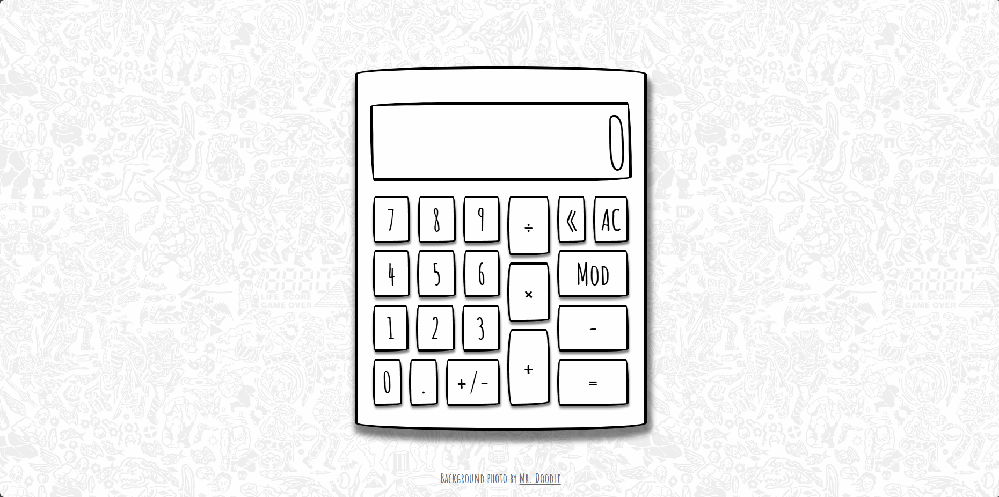

# A Calculator Doodle

Welcome to **A Calculator Doodle!** This web application features a playful calculator designed to evoke the fun doodles we created as kids. It allows users to perform basic arithmetic operations with a stylish interface.

## Functionality

The calculator accepts two inputs at a time and returns a number rounded to three decimal places. It also supports keyboard input for an enhanced user experience!

## Demo

## Features

- Keyboard Support: Use numpads, delete, and enter keys for easy input.
- Interactive CSS.

## What I learned from the project

- Developed a website using only pure JavaScript, HTML, and CSS.
- Gained experience with CSS Flexbox, animations, and transitions.

## Live Preview

Click [here](https://zukurai-kushal.github.io/calculator/) to view the live page.
